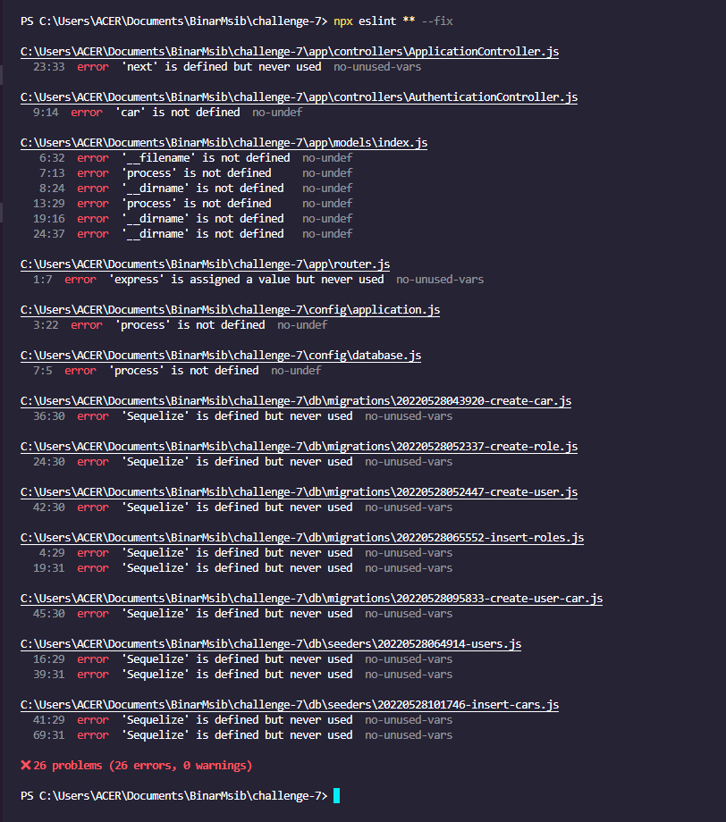
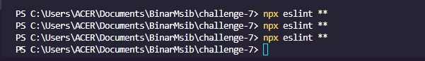
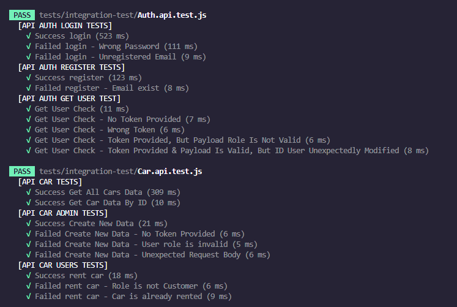
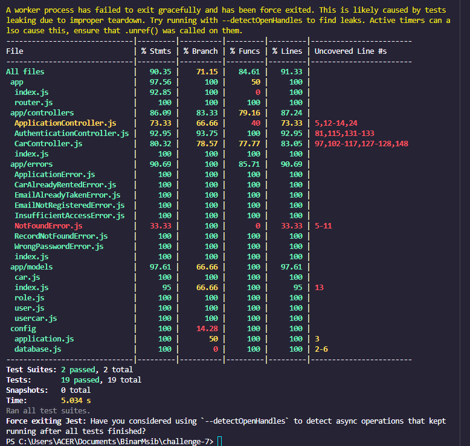

# Challenge 7 MSIB Binar Academy

Testing and Lint Scan using Jest, Supertest, & ESLint.

## Installation

- Clone This Repository
- `npm i`
- Rename `.env.example` to `.env` and configure based on your local
- `npm run db:create`
- `npm run db:migrate`
- `npm run db:seed`
- `npm run dev`

## Running ESLint

- `npm run lint`

## Running Testing

- `npm run test`

## ESLint Scan Result

Before (Scanning) :

     

After (Fixing) :

     

## Testing Result

Testing Result :

     

Testing Coverage :

     

# Data Diri

|                  |                          |
| ---------------- | ------------------------ |
| ID Peserta       | **FSW2402KM6001**        |
| Nama Peserta     | **Achmad Sarifitra N R** |
|                  |                          |
| Kelas            | **FSW 1**                |
|                  |                          |
| ID Fasil         | **F-FSW24001086**        |
| Nama Fasilitator | **Imam Taufiq Hermawan** |
|                  |                          |